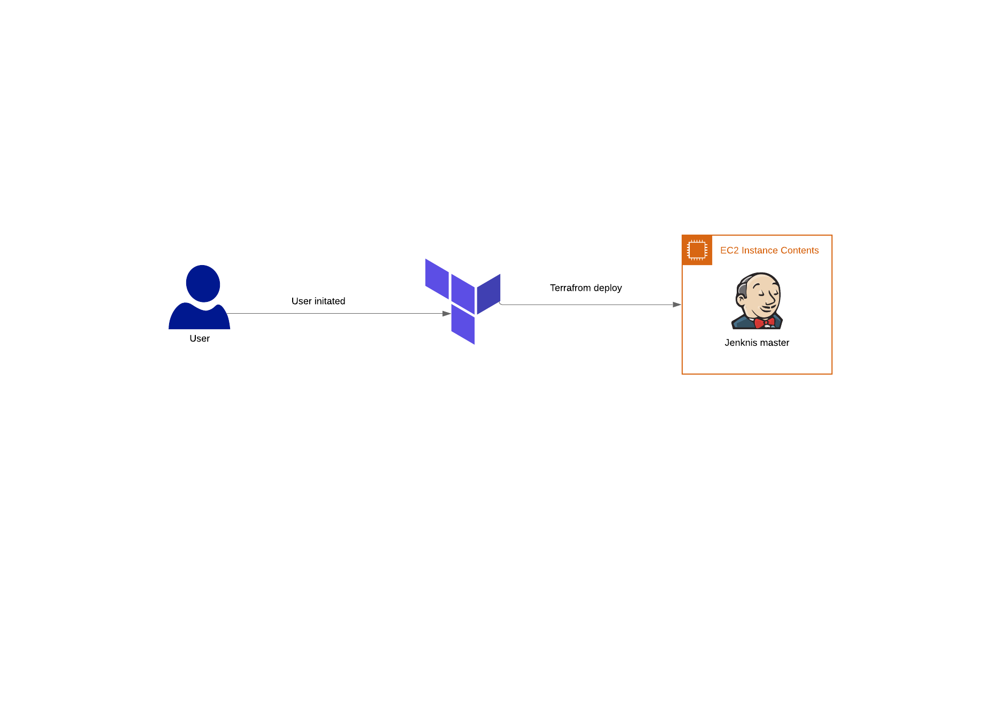

### jenkins-aws
Quick Jenkins master instance on AWS using terraform



***Jenkins IAM role are full access change to your needs***

Update ```provider.tf``` with your aws creds

To run ```terraform init``` ```terraform plan``` ```terraform apply```

To destroy ```terraform destroy```


